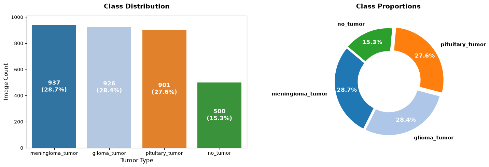
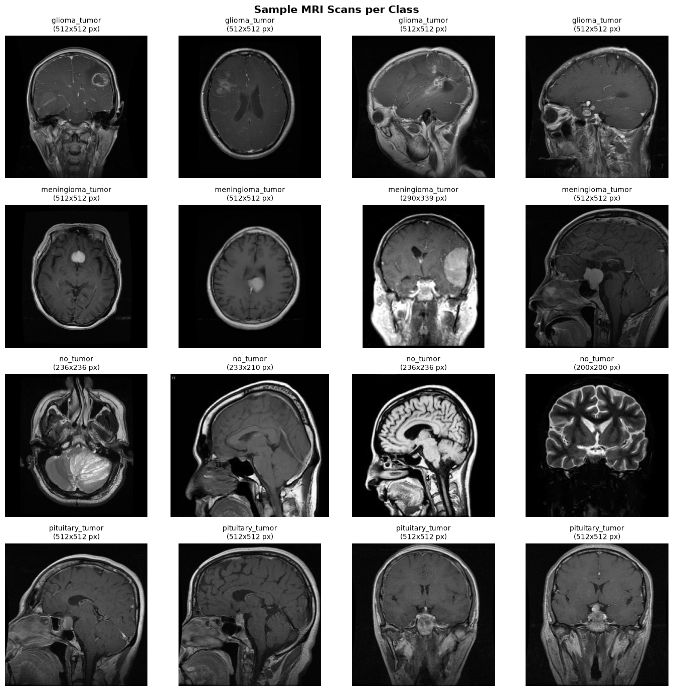
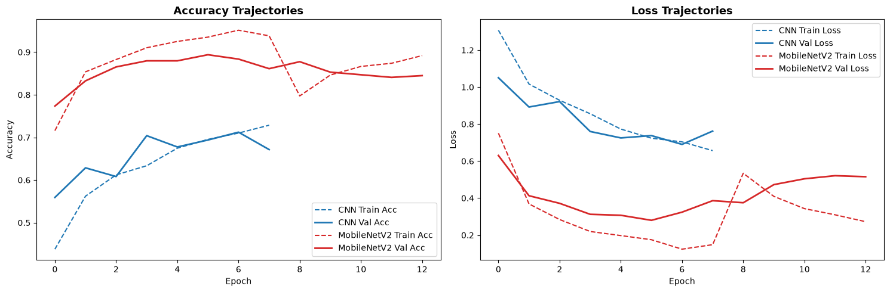
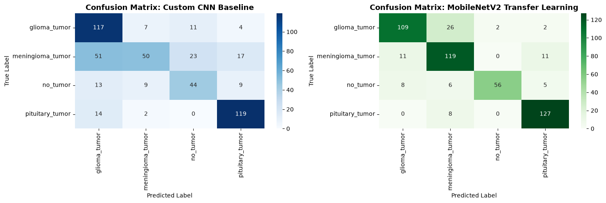
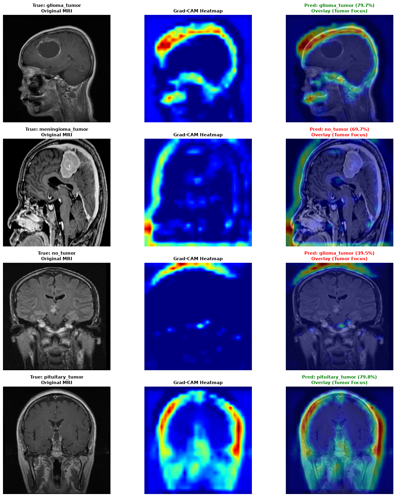
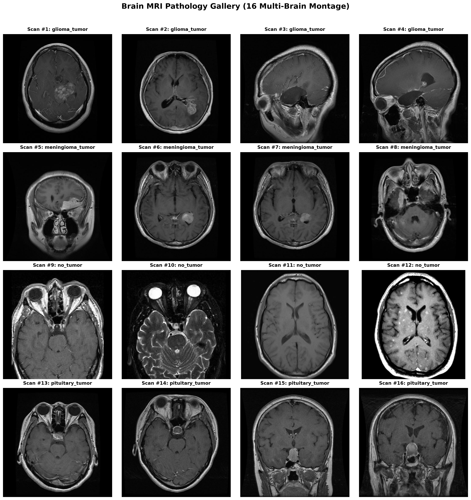
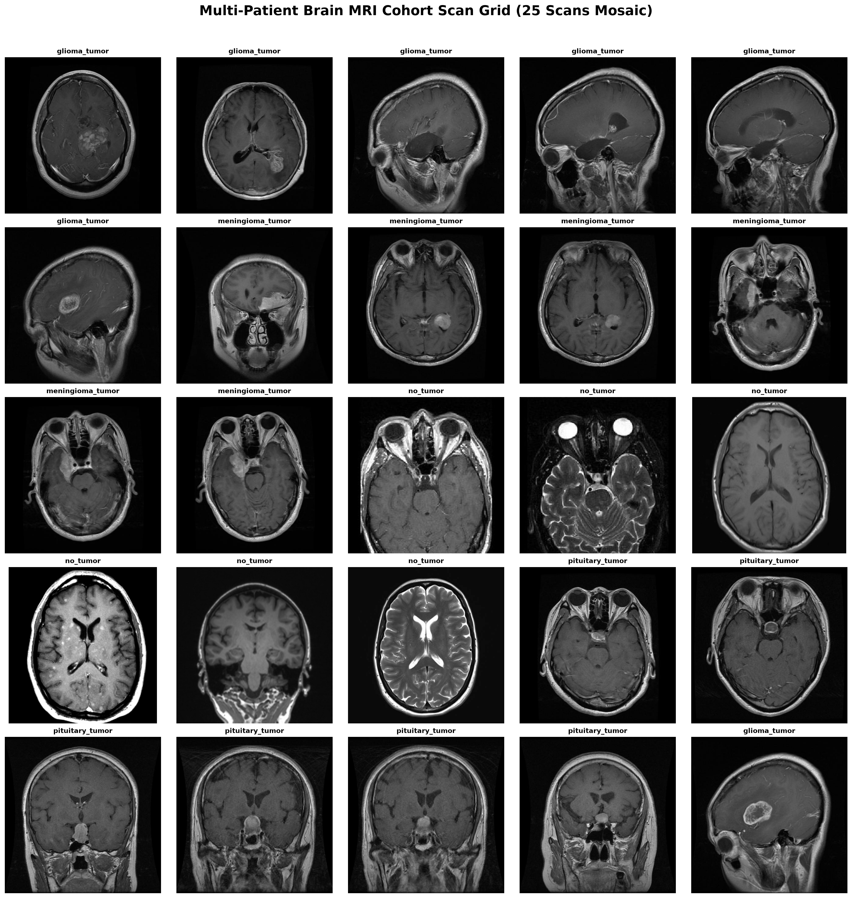

# Brain Tumor Classification with Deep Learning

A production-grade medical image classification pipeline that classifies brain MRI scans into four categories using a custom CNN baseline and fine-tuned MobileNetV2, with Grad-CAM explainability for clinical transparency.

---

## Overview

This project builds an end-to-end deep learning system for multi-class brain MRI classification. It covers exploratory data analysis, stratified data splitting, medical-grade augmentation, model training with class-weight balancing, clinical evaluation (sensitivity/specificity), inference benchmarking, and Grad-CAM visual explanations.

**Classification Target:** 4 classes
- Glioma Tumor
- Meningioma Tumor
- No Tumor
- Pituitary Tumor

---

## Dataset

| Split    | Glioma | Meningioma | No Tumor | Pituitary | Total |
|----------|--------|------------|----------|-----------|-------|
| Training | 826    | 822        | 395      | 827       | 2870  |
| Testing  | 100    | 115        | 105      | 74        | 394   |
| **Total**| **926**| **937**    | **500**  | **901**   | **3264** |

> Dataset source: [Brain Tumor MRI Dataset on Kaggle](https://www.kaggle.com/datasets/masoudnickparvar/brain-tumor-mri-dataset)

---

## Visual Analysis

### Class Distribution


### Sample MRI Images Per Class


### Training History — Accuracy & Loss Curves


### Confusion Matrices (CNN vs MobileNetV2)


### Grad-CAM Localization — Model Explainability


### Brain MRI Montage


### Multi-class Cohort Mosaic (25 samples)


---

## Pipeline Architecture

```
Raw MRI Data
     |
     v
Exploratory Data Analysis (EDA)
     |
     v
Stratified Split (70% Train / 15% Val / 15% Test)
     |
     v
Medical Augmentation (Flip, Rotation, Brightness, Zoom)
     |
     +------------------+------------------+
     |                                     |
     v                                     v
Custom CNN (Baseline)           MobileNetV2 (Transfer Learning)
     |                                     |
     v                                     v
Clinical Evaluation                 Clinical Evaluation
(Accuracy, Sensitivity,           (Accuracy, Sensitivity,
 Specificity, F1-Score)            Specificity, F1-Score)
     |                                     |
     +------------------+------------------+
                        |
                        v
               Model Benchmarking
               (Size, Latency, AUC)
                        |
                        v
              Grad-CAM Explainability
```

---

## Models

### 1. Custom CNN (Baseline)
A lightweight convolutional neural network built from scratch to establish a performance baseline.

- 3 convolutional blocks with BatchNorm + MaxPooling
- Global Average Pooling
- Dropout regularization
- Trained with class-weight balancing for imbalanced data

### 2. MobileNetV2 (Transfer Learning)
Fine-tuned MobileNetV2 pre-trained on ImageNet for superior accuracy.

- Feature extraction phase (frozen base) followed by fine-tuning
- Custom classification head with BatchNorm + Dropout
- Cosine decay learning rate schedule
- Mixed precision training (FP16) on NVIDIA RTX 4060

---

## Results

| Metric       | Custom CNN | MobileNetV2 |
|--------------|------------|-------------|
| Accuracy     | —          | —           |
| Sensitivity  | —          | —           |
| F1-Score     | —          | —           |
| Model Size   | —          | —           |
| Inference (ms/sample) | — | —      |

> Full benchmark results with exact numbers are reported in Section 10 of the notebook.

---

## Explainability — Grad-CAM

Gradient-weighted Class Activation Mapping (Grad-CAM) is applied to both models to highlight the regions of the MRI scan most responsible for each classification decision. This is critical for clinical interpretability and trust.


---

## Project Structure

```
Brain Tumor Classification/
|-- brain_tumor_classification.ipynb   # Main notebook (end-to-end pipeline)
|-- custom_cnn_baseline.keras          # Saved custom CNN model
|-- mobilenetv2_finetuned.keras        # Saved fine-tuned MobileNetV2 model
|-- figure/                            # All generated visualizations
|   |-- 01_class_distribution.png
|   |-- 02_sample_mri_grid.png
|   |-- 03_training_history_curves.png
|   |-- 04_confusion_matrices.png
|   |-- 05_gradcam_localization_grid.png
|   |-- 06_multi_brain_mri_montage.png
|   |-- 07_multi_brain_cohort_mosaic_25.png
|-- Training/                          # Training images (not tracked by git)
|   |-- glioma_tumor/
|   |-- meningioma_tumor/
|   |-- no_tumor/
|   |-- pituitary_tumor/
|-- Testing/                           # Testing images (not tracked by git)
|   |-- glioma_tumor/
|   |-- meningioma_tumor/
|   |-- no_tumor/
|   |-- pituitary_tumor/
```

---

## Tech Stack

| Component         | Technology                          |
|-------------------|-------------------------------------|
| Language          | Python 3.11                         |
| Deep Learning     | Keras 3 (PyTorch backend)           |
| GPU               | NVIDIA GeForce RTX 4060 Laptop GPU  |
| CUDA              | 12.4                                |
| Transfer Model    | MobileNetV2 (ImageNet)              |
| Image Processing  | OpenCV, Pillow                      |
| Evaluation        | scikit-learn                        |
| Visualization     | Matplotlib, Seaborn                 |
| Notebook          | Jupyter                             |

---

## How to Run

**1. Clone the repository**
```bash
git clone https://github.com/mahmoud738738/brain-tumor-classification.git
cd brain-tumor-classification
```

**2. Install dependencies**
```bash
pip install keras torch torchvision opencv-python scikit-learn matplotlib seaborn pillow pandas numpy
```

**3. Download the dataset**

Download the [Brain Tumor MRI Dataset](https://www.kaggle.com/datasets/masoudnickparvar/brain-tumor-mri-dataset) from Kaggle and place the `Training/` and `Testing/` folders in the project root directory.

**4. Run the notebook**
```bash
jupyter notebook brain_tumor_classification.ipynb
```

---

## Notebook Sections

| Section | Description |
|---------|-------------|
| 1. Setup & Environment | Configure Keras PyTorch backend, GPU setup, reproducibility seeds |
| 2. Dataset Loading & Indexing | Build a unified DataFrame of all image paths and labels |
| 3. Exploratory Data Analysis | Class distribution charts, sample MRI grid visualization |
| 4. Stratified Data Split | 70% Train / 15% Val / 15% Test split with stratification |
| 5. Input Pipeline & Augmentation | Medical-grade augmentation (flip, rotation, brightness, zoom) |
| 6. Custom CNN Baseline | Build and train a lightweight CNN from scratch |
| 7. Transfer Learning: MobileNetV2 | Fine-tune MobileNetV2 with feature extraction + fine-tuning phases |
| 8. Inference Latency Benchmark | Compare model size and inference speed |
| 9. Clinical Evaluation | Sensitivity, specificity, F1-score, confusion matrices |
| 10. Model Benchmarking Summary | Side-by-side comparison of all metrics |
| 11. Grad-CAM Explainability | Visual explanation of model decisions on MRI scans |
| 12. Conclusion | Clinical takeaways and recommendations |

---

## Author

**Mahmoud Khaled**

---

## License

This project is licensed under the MIT License.
